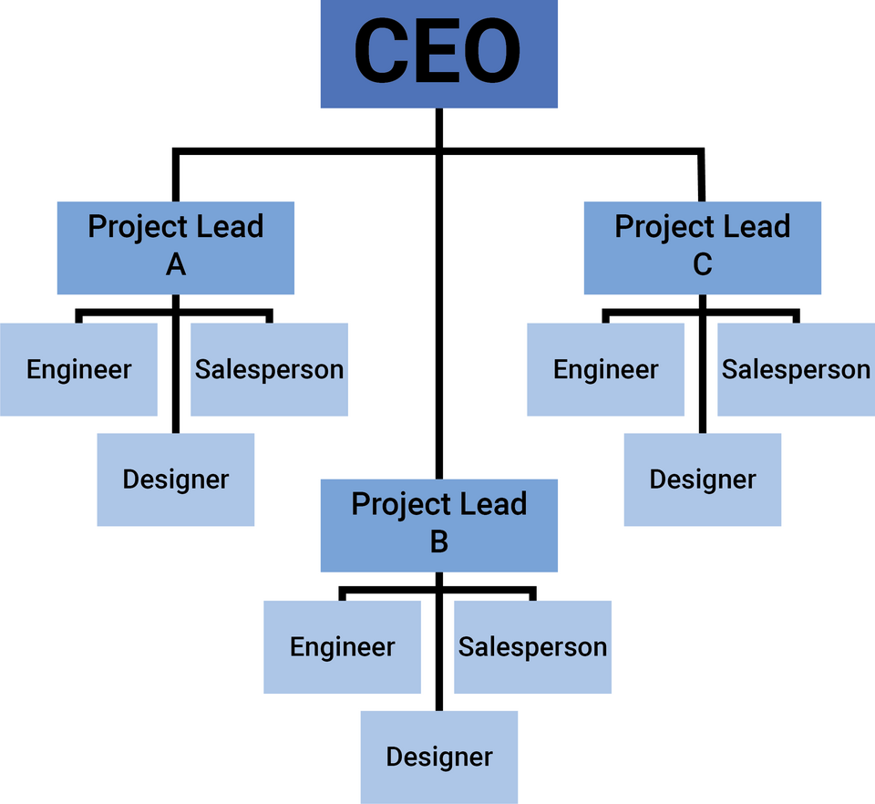

# 04.02 Hierarchy and Modularity

The ancient, and still valid, idea of “divide and conquer” is a premise to follow when creating a program:

_If the problem is simple, solve it. If not, split it into autonomous sub-tasks, resolve them, and merge the outcomes._

The idea of decompose, solve, and compose\[1] improves program structure, increases computational efficiency, and enables parallel implementation. The approach relies on two primary pillars: hierarchy and modularity.

Modularity involves decomposing a larger problem into smaller sub-problems called modules. The process can be repeated until the tasks are too trivial to be simplified. Now, after creating all modules, it is important to organize them according to their inherent structure. The modules follow a hierarchical form, where some tasks can be considered “parents” with their own “sons”. This top-to-bottom, tree-like structure refers to the execution of the modules and is known as a hierarchy.

Figure 04.01 shows an example of a hierarchy structure. Each element is the father and the son of another element, except the origin (root) and the end-nodes (leaves). A node can be described as self-contained, but it has specific relationships with connected nodes. A similar chart will be explained in the next section and will work as the early model for programming.

<figure><figcaption>
Figure 04.01 "<a href="https://commons.wikimedia.org/w/index.php?curid=88866837">Team Structure Org Chart</a>" by <a href="https://commons.wikimedia.org/w/index.php?title=User:Jedmondstone&#x26;action=edit&#x26;redlink=1">Jorden Edmondstone</a> (license <a href="https://creativecommons.org/licenses/by-sa/4.0/?ref=openverse">CC BY-SA 4.0</a>)
</figcaption></figure>

 

***

\[1] Smith, D. R. (1985). The design of divide and conquer algorithms. _Science of Computer Programming_, _5_, 37-58.
